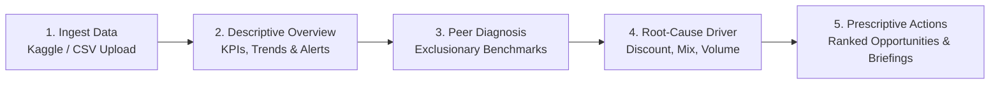

# Performa.io — Retail Performance Intelligence

> **Performance, diagnosed.**
> *From raw transactions to root-cause diagnosis, ranked commercial opportunities, and executive action plans.*

---

## 💡 The Core Idea

Most retail business intelligence tools are either **generic BI dashboards** that overload managers with descriptive charts without context, or **over-engineered ML showcases** that make opaque predictions without actionable business rationale.

When an executive asks:
1. *"Where are we losing money?"*
2. *"Why is margin compressing despite healthy sales volume?"*
3. *"Which specific operational levers should management pull first?"*

Traditional dashboards leave them searching manually through dozens of slicers.

**Performa.io** was engineered as an internal consulting-grade decision-support platform designed around a fundamental three-stage progression:

$$\Large \mathbf{Descriptive} \longrightarrow \mathbf{Diagnostic} \longrightarrow \mathbf{Prescriptive}$$



---

## 🎯 What Makes Performa.io Different?

### 1. Deterministic, Transparent Intelligence (No Black Boxes)
Instead of uninterpretable machine learning models, Performa.io executes **transparent, rule-based diagnostic algorithms**. Every insight is grounded in audited transaction telemetry with explicit mathematical formulas and confidence ratings.

### 2. Bias-Free Peer Benchmarking
When evaluating any entity (such as a territory like *Central*, a category like *Furniture*, or a sub-category like *Tables*), the engine dynamically calculates peer averages **strictly excluding the selected entity**. This prevents self-referential bias and provides an objective benchmark baseline.

### 3. Multi-Factor Opportunity Scoring
Commercial opportunities are prioritized using an objective, multi-dimensional ranking algorithm:

$$\mathbf{Opportunity\ Score} = 0.40 \times \text{Business Impact} + 0.30 \times \text{Performance Gap} + 0.20 \times \text{Feasibility} + 0.10 \times \text{Urgency}$$

- **Business Impact (40%)**: Absolute dollar profit and revenue exposure at risk.
- **Performance Gap (30%)**: Distance from peer benchmark efficiency.
- **Feasibility (20%)**: Actionability rating (e.g. pricing/discount policy changes vs. long-term structural expansion).
- **Urgency (10%)**: Immediate escalation if operating at a net loss or steep margin erosion.

---

## 🔍 The 5 Root-Cause Diagnostic Patterns

Performa.io automatically detects and isolates the 5 classic commercial retail failure and success modes:

| Diagnostic Pattern | Mathematical Condition | Business Diagnosis & Prescriptive Strategy |
| :--- | :--- | :--- |
| **🚨 Critical Operating Loss** | $\text{Net Profit} < \$0$ | **Value Destruction**: Unit revenue fails to cover base COGS and fulfillment overhead. *Action: Immediately enforce SKU-level margin floors and halt unhedged promotional markdowns.* |
| **📉 Discount Leakage** | $\text{Discount} > \text{Peer Avg} \ \ \land \ \ \text{Margin} < \text{Peer Avg}$ | **Price Erosion**: Discretionary discounting is compressing gross margin without generating proportional volume lift. *Action: Establish strict discount approval thresholds and tie discounts to bulk commitments.* |
| **⚖️ Unfavorable Product Mix** | $\text{Revenue} \ge \text{Peer Avg} \ \ \land \ \ \text{Margin} < \text{Peer Avg}$ | **Mix Distortion**: Top-line demand is strong, but sales are heavily concentrated in low-margin SKUs. *Action: Shift sales incentives toward high-margin accessories, attach rates, and bundles.* |
| **📦 Demand / Volume Weakness** | $\text{Orders} < \text{Peer Avg} \ \ \land \ \ \text{Revenue} < \text{Peer Avg}$ | **Under-Penetration**: Unit economics and pricing integrity are healthy, but transaction velocity is lagging. *Action: Deploy targeted re-engagement campaigns and expand sales distribution.* |
| **⭐ Star Market Performer** | $\text{Revenue} > \text{Peer Benchmark} \ \ \land \ \ \text{Margin} > \text{Peer Benchmark}$ | **Core Profit Driver**: Delivering superior returns across both volume and margin. *Action: Replicate sales strategies across lagging units and explore capacity expansion.* |

---

## 🖥️ Product Walkthrough & Application Flow

### 1. Executive Overview (`/`)
- **Headline Financial Telemetry**: Total Revenue, Net Profit, Profit Margin %, Order Count, Units Sold, Average Order Value (AOV), and Average Discount Rate with period-over-period growth comparisons.
- **Automated Anomaly Alert Banners**: Immediate executive notification cards highlighting active margin leaks and top profit contributors.
- **Financial Trend & Margin Trajectory**: Monthly and quarterly revenue vs. profit bars with margin percentage overlays.
- **Category & Regional Matrices**: Portfolio revenue and profit share distributions.

### 2. Entity Root-Cause Diagnosis (`/diagnose`)
- Interactive dimension selector (*Region, State, Category, Sub-Category, Segment*).
- Side-by-side **Peer Benchmark Comparison Cards** displaying the selected entity against its peer baseline with visual delta indicators.
- **Diagnostic Confidence Score** (evaluating sample size robustness).
- Quantified **Supporting Evidence** and concrete **Prescriptive Actions**.

### 3. Multi-Dimensional Data Explorer (`/explore`)
- **80/20 Pareto Concentration Curve**: Visualizes cumulative revenue contribution to identify top revenue drivers.
- **Interactive Multi-Column Data Table**: Sortable across all metrics with margin heat maps and search filtering.

### 4. Prioritized Value Creation Opportunities (`/opportunities`)
- Ranked opportunity leaderboard scored out of 100 with priority tiers (*High, Medium, Low*).
- **Master-Detail Action Plan**: Step-by-step 3-stage execution roadmap for each identified opportunity with quantifiable annual exposure estimates ($).

### 5. Executive Performance Briefing (`/reports`)
- Management-ready briefing document summarizing macroeconomic performance, key strategic findings, major loss areas, and action matrices.
- Built-in **Print / Export to PDF** layout with print-optimized styling and clean page breaks.

---

## 🛠️ Architecture & Tech Stack

```
performa.io/
├── backend/                       # Python FastAPI Backend
│   ├── app/
│   │   ├── api/routes.py          # REST Endpoints (KPIs, Diagnostics, Opportunities, Reports)
│   │   ├── services/
│   │   │   ├── data_service.py    # CSV Loader, Schema Validation & Alias Mapping
│   │   │   ├── analytics_service.py # Vectorized KPI & Trend Calculations
│   │   │   ├── diagnostic_service.py# Peer Benchmarking & Rule Engine
│   │   │   ├── opportunity_service.py# Multi-Factor Opportunity Scoring
│   │   │   └── report_service.py  # Executive Briefing Generator
│   │   └── config.py              # Thresholds, Scoring Weights & Column Aliases
│   ├── data/
│   │   └── sample_retail_data.csv # Bundled Kaggle Superstore Dataset (9,994 rows)
│   └── tests/                     # Unit & Integration Pytest Suite (17 Tests)
│
├── frontend/                      # React 18 + TypeScript + Vite SPA
│   ├── src/
│   │   ├── components/            # Reusable UI (KpiCard, BenchmarkCard, StatusBadge, etc.)
│   │   ├── pages/                 # Overview, Diagnose, Explore, Opportunities, Reports
│   │   ├── context/               # Global Filter & Dataset State
│   │   └── lib/                   # API Client + Client-Side Fallback Analytics
│   └── public/                    # Static Assets & Netlify _redirects
│
└── netlify.toml                   # Netlify Deployment Configuration
```

---

## 🚀 Getting Started

### Prerequisites
- **Node.js** v18+ and **npm**
- **Python** 3.10+ and **pip**

### 1. Run the Backend API
```bash
cd backend
python -m pip install -r requirements.txt
python -m uvicorn app.main:app --host 127.0.0.1 --port 8000 --reload
```
- API will run at: `http://127.0.0.1:8000`
- Interactive Swagger docs: `http://127.0.0.1:8000/docs`

### 2. Run the Frontend Application
```bash
cd frontend
npm install
npm run dev -- --port 3003
```
- Open in your browser: `http://localhost:3003`

### 3. Run Automated Tests
```bash
$env:PYTHONPATH="backend"; python -m pytest backend/tests -v
```

---

## 🌐 Netlify Deployment

The repository is pre-configured for zero-friction Netlify hosting via [`netlify.toml`](file:///d:/performa.io/netlify.toml):
- **Base directory**: `frontend`
- **Build command**: `npm run build`
- **Publish directory**: `dist`
- **SPA Routing**: Configured with single-page application rewrites (`/* -> /index.html 200`).

---

## 📊 Dataset Attribution
- **Dataset**: Kaggle Superstore Retail Transactions
- **Scope**: 9,994 retail transactions across 4 Regions, 49 States, 3 Categories, 17 Sub-Categories, and 3 Customer Segments.
